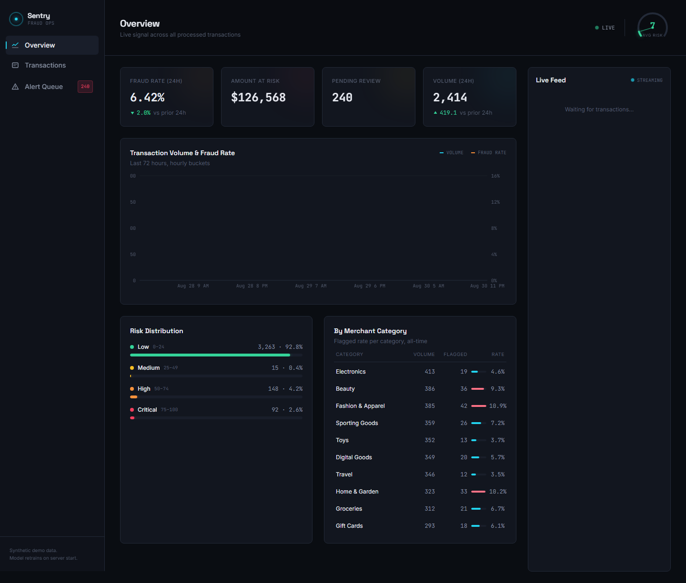
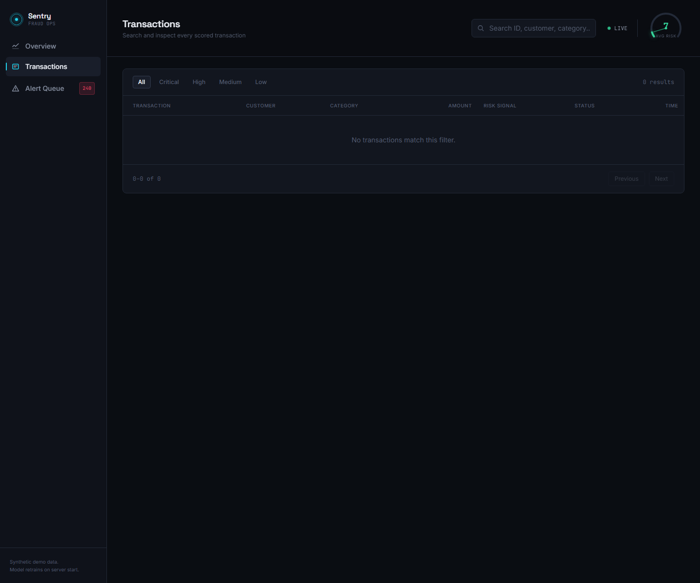
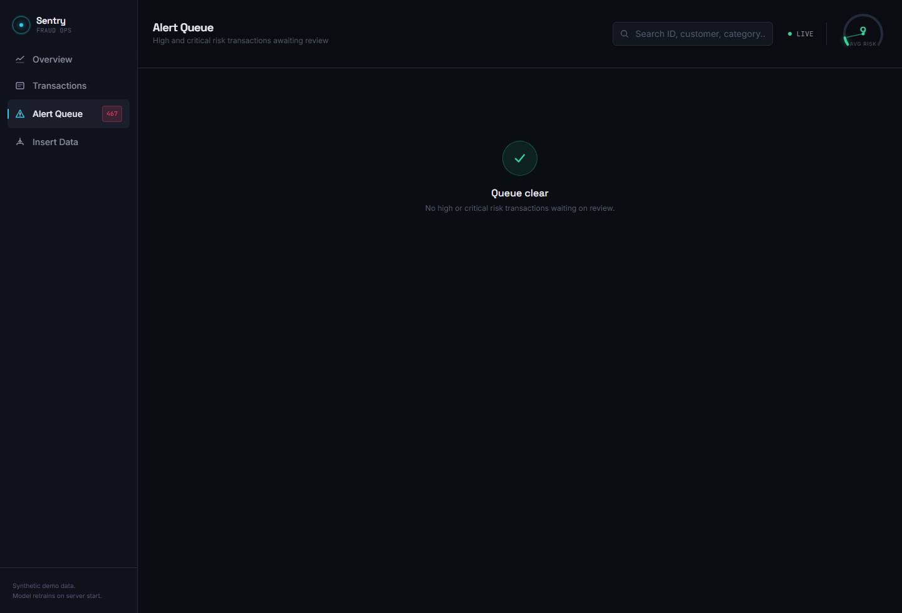

# Sentry — Fraud Detection Console

Sentry is a fraud-monitoring dashboard and ML demo that simulates an operations center for reviewing suspicious digital transactions in near real time. The project combines a Python FastAPI backend, synthetic transaction generation, model-based risk scoring, and a React dashboard for live monitoring and intervention.

This version of the project includes the full workflow for synthetic generation, manual import, review queue handling, and operational KPI tracking.

## Live dashboard

### Overview



### Transactions view



### Alert queue



## What the app does

- Streams a live transaction feed from the backend over WebSockets
- Scores transactions using a trained fraud-risk model and anomaly logic
- Shows operational KPIs for volume, amount, fraud rate, and pending reviews
- Surfaces high-risk records in an alert queue for analyst review
- Supports manual import of CSV/XLSX/XLS data to replace synthetic generation
- Lets operators pause live generation and resume it when needed

## Features

### Fraud risk detection
- Generates realistic shopping and payment events across common merchant categories
- Uses a scikit-learn fraud classifier combined with anomaly scoring
- Maps model output to operational risk bands: low, medium, high, and critical
- Produces explainable reason codes and risk metadata for each flagged transaction

### Operations workflow
- Tracks live throughput and suspicious volumes across the last 30 minutes
- Shows risk distribution and merchant category breakdowns
- Lists transactions and alerts with filtering and search
- Supports approve/block decisions that update the review state

### Manual data import
- Upload CSV, XLSX, or XLS files through the Insert Data page
- Normalizes common column aliases automatically to the internal schema
- Pauses synthetic live generation while imported data is active
- Rebuilds the dashboard around the imported transaction set

## Architecture

### Backend
The backend is built with Python and FastAPI.

Core files:
- backend/main.py — API routes, startup logic, live feed, and file upload pipeline
- backend/data_generator.py — synthetic transaction generation
- backend/model.py — fraud model training and scoring logic
- backend/database.py — SQLite persistence and query helpers
- backend/config.py — app configuration and CORS setup

### Frontend
The frontend is built with React, Vite, Tailwind CSS, and Recharts.

It includes:
- overview dashboard cards and charts
- transaction search/filter controls
- alert queue review actions
- Insert Data workflow for file imports

## Tech stack

- Python 3.11+
- FastAPI
- Uvicorn
- SQLAlchemy
- scikit-learn
- pandas / NumPy
- openpyxl
- React 19
- Vite
- Tailwind CSS
- Recharts

## Deployed app

The project is already deployed and running here:

- Backend: https://fraud-detection-scheme.onrender.com/
- Frontend: https://fraudfrontend-ekzm0s5r8-priyanshukalondia-8616s-projects.vercel.app/

## Local setup

### Prerequisites
- Python 3.11+
- Node.js 18+
- npm

### 1) Create the backend environment
From the project root:

```bash
python -m venv .venv
# Windows
.\.venv\Scripts\activate
# macOS/Linux
# source .venv/bin/activate

python -m pip install --upgrade pip
python -m pip install -r backend/requirements.txt
```

### 2) Start the backend
```bash
cd "c:\Users\HP\Downloads\sentry_fraud-detector"
.\.venv\Scripts\python.exe -m uvicorn main:app --app-dir .\backend --host 0.0.0.0 --port 8000
```

On macOS/Linux:

```bash
cd /path/to/sentry_fraud-detector
source .venv/bin/activate
uvicorn main:app --app-dir ./backend --host 0.0.0.0 --port 8000
```

The backend initializes the SQLite database, trains the fraud-risk model, and starts the synthetic transaction generator on startup.

### 3) Start the frontend
In a second terminal:

```bash
cd frontend
npm install
npm run dev -- --host 0.0.0.0 --port 5173
```

If you want to use the deployed backend from a local frontend, configure the frontend environment variable:

```bash
VITE_API_BASE_URL=https://fraud-detection-scheme.onrender.com
```

For local-only development, the default app is still compatible with `http://localhost:5173` and `http://localhost:8000` when you run both services locally.

## API endpoints

The backend exposes the following routes:

- GET /api/health — health and model status
- GET /api/stats — summary KPIs
- GET /api/timeseries — recent fraud trend data
- GET /api/risk-distribution — counts by risk band
- GET /api/category-breakdown — category-level flagged rates
- GET /api/transactions — transaction records with filters and search
- GET /api/alerts — pending review queue
- POST /api/transactions/{txn_id}/review — approve or block a transaction
- POST /api/data/stop-live-generation — pause synthetic generation
- POST /api/data/resume-live-generation — resume synthetic generation
- POST /api/data/upload — upload a CSV/XLSX/XLS dataset to drive the dashboard
- WebSocket /ws/live — real-time transaction stream

## Manual import workflow

From the frontend:

1. Open the Insert Data page
2. Upload a CSV, XLSX, or XLS file
3. The system normalizes common aliases and applies the model to each row
4. Live synthetic generation pauses
5. The imported rows replace the current active dataset in the dashboard

This is useful for demos where you want to operate against a curated file instead of live generated data.

## Project status

This repository is a working prototype and portfolio-ready demo for:
- fraud detection operations
- ML-assisted monitoring UX
- dashboard-driven review workflows
- synthetic data pipelines for product demos and interviews

## Notes

The project intentionally uses synthetic data and is not connected to real payment systems or production fraud data. It is designed to showcase system architecture, operational logic, and decision-support workflows in a realistic but safe environment.
